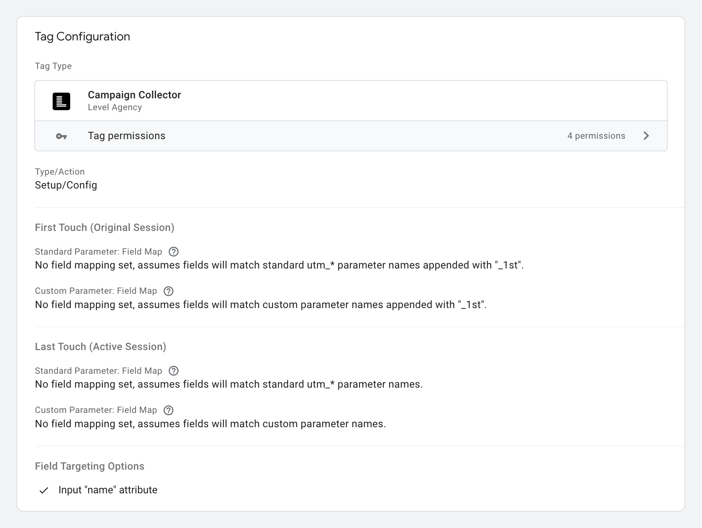

# Campaign Collector

---

This tag template is a wrapper around the main CampaignCollector.js library and provides a simplified interface for users to configure the library without having to utilize Custom HTML/JS code to do so. 

> [!IMPORTANT]
> For a full README on what this tag does. Please see the main [CampaignCollector.js](https://github.com/LevelInteractive/campaign-collector) library.

### Permissions

#### Injects Scripts
This tag template loads Level's [CampaignCollector](https://github.com/LevelInteractive/campaign-collector) library through the [jsDelivr.com](https://www.jsdelivr.com/) CDN.

Google does not offer a way to let the end user define what location the scripts are loaded from inside their tag template sandboxed JS and permission set. If you wish to load the library via your own 1st party domain (or another CDN), you will need to use the Custom HTML/JS tag template and host the library yourself. Please see [CampaignCollector: Installation Options](https://github.com/LevelInteractive/campaign-collector?tab=readme-ov-file#installation-options).

#### Accesses Global Variables

- The template will write/read/execute to a `_campaignCollector` global variable, and several sub-properties of it. 
- The template will access the `CampaignCollector.create` method to initialize a the library on the `_campaignCollector` global mentioned above.
- The template will access the `CampaginCollector.consentChange` method to emit an event to the instances to handle changes in consent state for `ad_storage`, `analytics_storage`, `ad_user_data`, `ad_personalization`

#### Reads Consent State

The template will listen/read the consent state for the following types:  

- `ad_storage`
- `analytics_storage`
- `ad_user_data`
- `ad_personalization`

### Author(s)
[@derekcavaliero](https://github.com/derekcavaliero)
